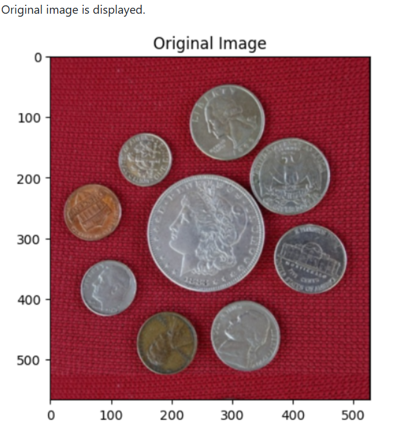
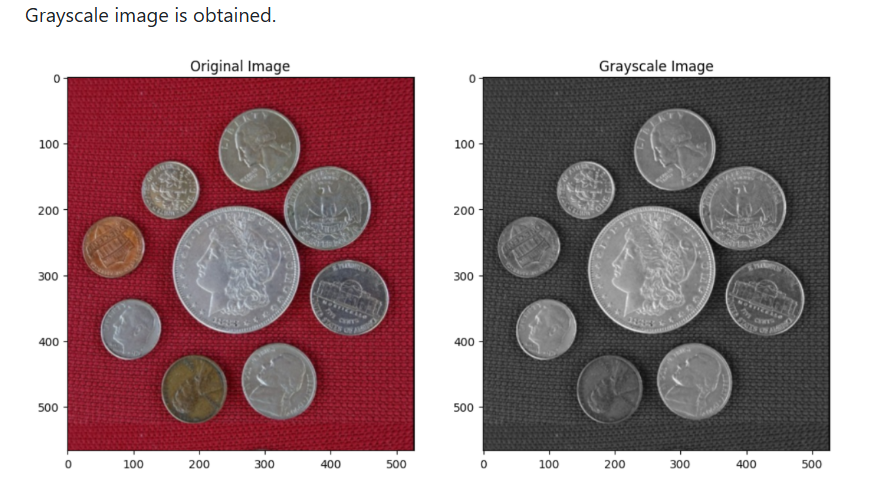
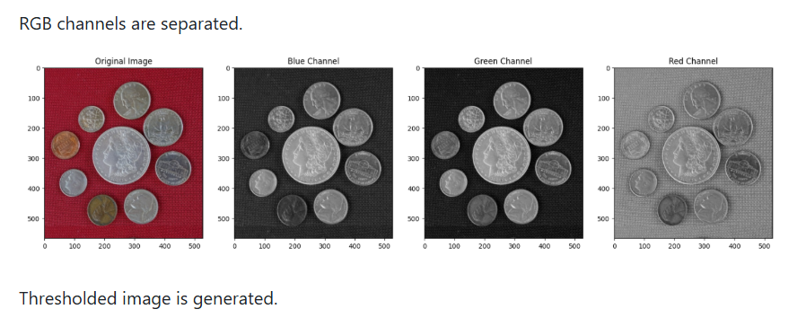
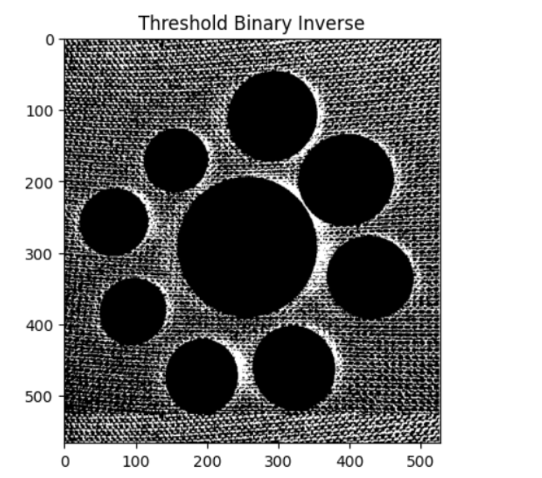
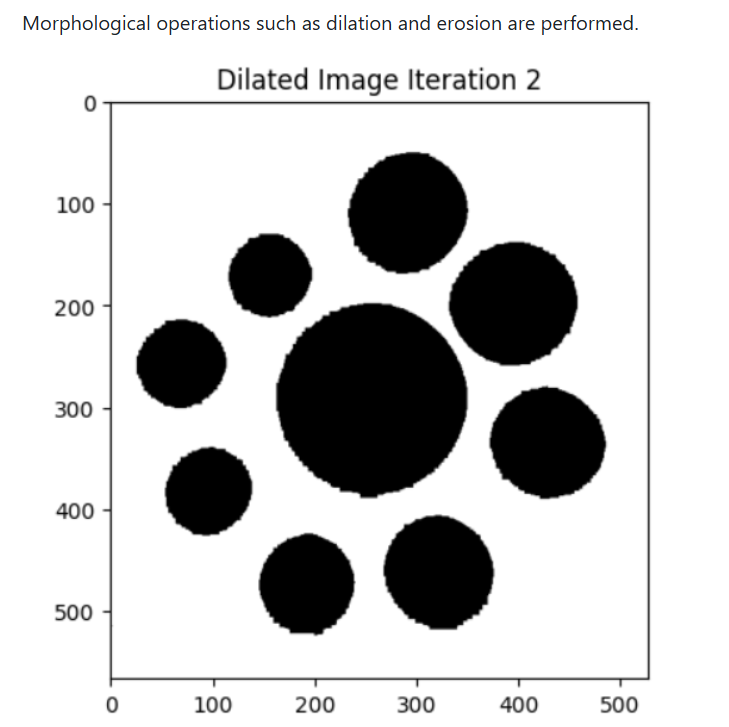
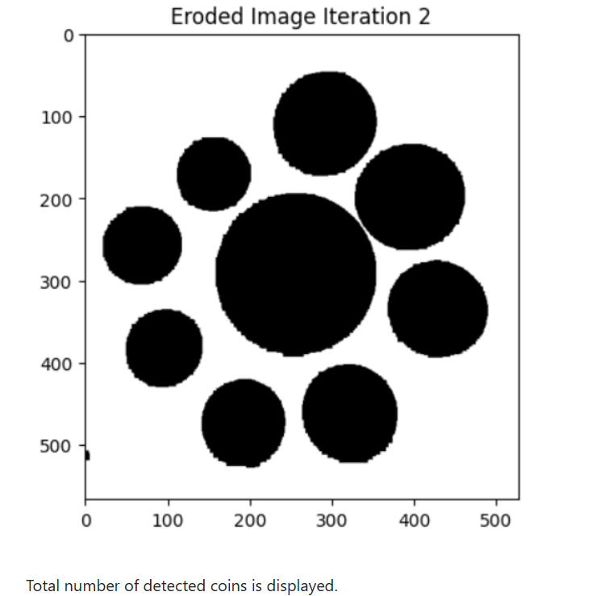

# WORKSHOP--4-Coin-Detection-using-OpenCV-in-Python
# MORPHOLOGICAL-OPERATIONS-AND-COIN-DETECTION-USING-OPENCV

## Workshop No: 4

### Name:
Krithika Lakshmi M

### Register Number:
212224230134

## AIM:

To perform morphological operations and coin detection using OpenCV.

Software Required
Anaconda - Python 3.7
OpenCV
Matplotlib
NumPy
Jupyter Notebook

## Algorithm:

Step 1:

Import the required libraries such as OpenCV, NumPy, and Matplotlib.

Step 2:

Read the input image coin.jpeg using OpenCV.

Step 3:

Display the original image.

Step 4:

Convert the image into grayscale.

Step 5:

Split the image into Red, Green, and Blue channels.

Step 6:

Apply thresholding to convert the image into binary format.

Step 7:

Perform dilation operation to enlarge the white regions.

Step 8:

Perform erosion operation to remove unwanted noise.

Step 9:

Create a Simple Blob Detector using OpenCV parameters.

Step 10:

Detect coins using the blob detector.

Step 11:

Display the detected coins and print the number of coins detected.

## PROGRAM:

Step 1: Import Required Libraries
```py
import cv2
import matplotlib.pyplot as plt
import numpy as np
%matplotlib inline
```
Step 2: Read the Input Image
```py
img = cv2.imread('coin.jpeg')
```
Step 3: Display the Original Image
```py
plt.imshow(img[:,:,::-1])
plt.title("Original Image")
plt.axis('off')
plt.show()
```
Step 4: Convert Image to Grayscale
```py
gray = cv2.cvtColor(img, cv2.COLOR_BGR2GRAY)

plt.figure(figsize=(12,12))

plt.subplot(121)
plt.imshow(img[:,:,::-1])
plt.title("Original Image")

plt.subplot(122)
plt.imshow(gray, cmap='gray')
plt.title("Gray Image")

plt.show()
```
Step 5: Split Image into RGB Channels
```py
imageB, imageG, imageR = cv2.split(img)

plt.figure(figsize=(20,12))

plt.subplot(141)
plt.imshow(img[:,:,::-1])
plt.title("Original Image")

plt.subplot(142)
plt.imshow(imageR, cmap='Reds')
plt.title("Red Channel")

plt.subplot(143)
plt.imshow(imageG, cmap='Greens')
plt.title("Green Channel")

plt.subplot(144)
plt.imshow(imageB, cmap='Blues')
plt.title("Blue Channel")

plt.show()
```
Step 6: Perform Thresholding
```py
ret, thr = cv2.threshold(
    imageG,
    20,
    125,
    cv2.THRESH_BINARY_INV
)

plt.imshow(thr, cmap='gray')
plt.title("Threshold Binary Inverse")
plt.axis('on')
plt.show()
```
Step 7: Perform Dilation
```py
dil = cv2.dilate(
    thr,
    np.ones((5,5)),
    iterations = 2
)

plt.imshow(dil, cmap='gray')
plt.title("Dilated Image Iteration 2")
plt.axis('on')
plt.show()
```
Step 8: Perform Erosion
```py
ero = cv2.erode(
    dil,
    np.ones((5,5)),
    iterations = 2
)

plt.imshow(ero, cmap='gray')
plt.title("Eroded Image Iteration 2")
plt.axis('on')
plt.show()
```
Step 9: Create Simple Blob Detector
```py
params = cv2.SimpleBlobDetector_Params()

detector = cv2.SimpleBlobDetector_create(params)
```
Step 10: Detect Coins
```py
keypoints = detector.detect(ero)
Step 11: Print Number of Coins Detected
print(f"Number of coins detected: {len(keypoints)}")
```
## OUTPUT:
Original image is displayed.



Grayscale image is obtained.



RGB channels are separated.



Thresholded image is generated.



Morphological operations such as dilation and erosion are performed.



Coins are detected using the blob detector.



Total number of detected coins is displayed.

## RESULT:

Thus, morphological operations and coin detection were successfully performed using OpenCV and the number of coins present in the image was detected successfully.